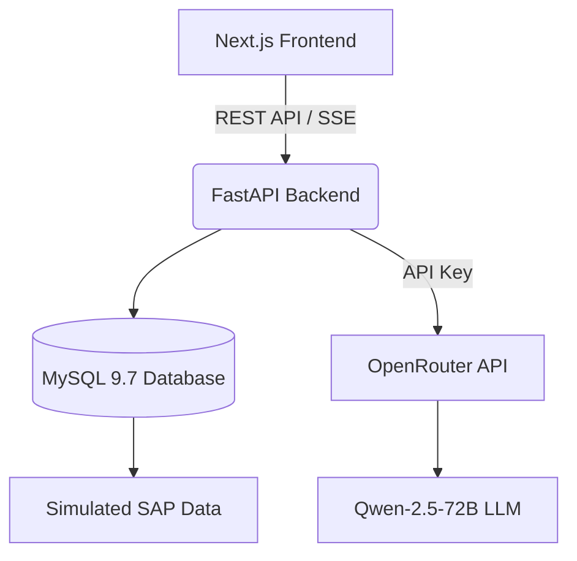

# PrimeActionOS 🚀

PrimeActionOS is a high-fidelity, full-stack Enterprise AI platform designed to act as an "Executive Copilot" for CFOs and operations leaders. It bridges the gap between raw enterprise ERP data (like SAP) and strategic decision-making by analyzing anomalies, projecting financial impacts, and generating AI-driven recommendations in real-time.


## Overview
Traditional ERP systems contain massive amounts of data but lack the intelligence to provide immediate, strategic guidance. PrimeActionOS solves this by simulating an ingestion pipeline from an enterprise SAP environment and feeding it into an AI-powered financial simulation engine. Executives can interact with a live AI Copilot to query their data, explore interactive digital twins of their supply chain, and instantly see the EBITDA impact of supply chain anomalies.

## Key Features
* **Executive Command Center:** A stunning, light-mode dashboard visualizing enterprise operational health, active revenue leakages, and procurement bottlenecks.
* **Enterprise Digital Twin:** An interactive knowledge graph visualization mapping the relationships between SAP tables (e.g., `VBAK`, `EKKO`), business processes, and detected anomalies.
* **Action Review Workbench:** A Kanban-style board allowing executives to simulate, approve, or reject AI-generated mitigation strategies.
* **SAP Object Lineage Explorer:** Deep-dive views into simulated SAP Transport Requests and data flows.

## How It Works
1. **Data Ingestion (Simulated):** The backend reads mock SAP tabular data (e.g., BKPF, BSEG, VBAK).
2. **Analysis Engine:** Python-based simulation logic determines the current operational bottlenecks and calculates lost revenue.
3. **AI Recommendation:** The backend communicates with a live Large Language Model to format and explain the anomalies.
4. **Executive Action:** The insights are streamed to a Next.js frontend where the CFO can interact with the Copilot to take action.

## Architecture



## Tech Stack

| Layer | Technology | Purpose |
| :--- | :--- | :--- |
| **Frontend** | Next.js 14, React, Tailwind, MUI v5 | UI, Routing, Component Architecture |
| **Backend** | FastAPI, Python 3.13 | High-performance API, Async processing |
| **Database** | MySQL 9.7, SQLAlchemy 2.0 | Relational data modeling, ORM |
| **AI Integration** | OpenAI SDK, OpenRouter | Live LLM Copilot Streaming |
| **Visualizations**| Recharts, SVG Graphing | Enterprise Dashboards, Knowledge Graphs |

## Project Structure

```text
prime-action-os/
├── backend/
│   ├── app/
│   │   ├── api/            # FastAPI route controllers
│   │   ├── core/           # Config and database setup
│   │   ├── models/         # SQLAlchemy database models
│   │   ├── services/       # AI, SAP, and business logic
│   │   └── main.py         # Application entry point
│   ├── seed.py             # Database seeding script
│   └── requirements.txt    # Python dependencies
├── frontend/
│   ├── src/
│   │   ├── app/            # Next.js pages and routing
│   │   ├── components/     # React UI components
│   │   └── lib/            # Utilities and state management
│   ├── package.json        # Node.js dependencies
│   └── tailwind.config.ts  # Tailwind CSS configuration
└── README.md
```

## Getting Started

### Prerequisites
* Node.js (v18+)
* Python (3.11+)
* MySQL Server (v8+)

### Database Setup
1. Ensure your MySQL server is running locally on port 3306.
2. Log into MySQL and create the database:
   ```sql
   CREATE DATABASE prime_action_os;
   ```

### Backend Setup
1. Open a terminal and navigate to the backend directory:
   ```bash
   cd backend
   ```
2. Install Python dependencies:
   ```bash
   pip install -r requirements.txt
   ```
3. Create a `.env` file in the `backend/` folder:
   ```env
   MYSQL_HOST=localhost
   MYSQL_PORT=3306
   MYSQL_DATABASE=prime_action_os
   MYSQL_USER=root
   MYSQL_PASSWORD=your_mysql_password
   OPENROUTER_API_KEY=your_openrouter_api_key
   ```
4. Seed the database with simulated enterprise data:
   ```bash
   python seed.py
   ```
5. Start the FastAPI server:
   ```bash
   uvicorn app.main:app --host 0.0.0.0 --port 8000
   ```

### Frontend Setup
1. Open a new terminal and navigate to the frontend directory:
   ```bash
   cd frontend
   ```
2. Install Node dependencies:
   ```bash
   npm install
   ```
3. Start the Next.js development server:
   ```bash
   npm run dev
   ```
4. Open your browser and navigate to `http://localhost:3000`.

## AI CFO Copilot
The Executive Copilot feature connects directly to the **Qwen-2.5-72B-Instruct** Large Language Model via the **OpenRouter API**. 

When a user submits a question in the chat, the FastAPI backend retrieves the current simulated P&L context from MySQL, constructs a highly specific system prompt defining the AI as a CFO assistant, and streams the inference directly back to the frontend using Server-Sent Events (SSE) for a real-time typewriter effect.

## API Documentation
Once the backend is running, FastAPI automatically generates interactive OpenAPI documentation.
* **Swagger UI:** Navigate to `http://localhost:8000/docs` to test endpoints directly.
* **ReDoc:** Navigate to `http://localhost:8000/redoc` for alternative documentation formatting.

## Security Considerations
* **API Key Protection:** The OpenRouter API key is exclusively loaded server-side via the `.env` file and is never exposed to the Next.js client.
* **Database Sanitization:** SQLAlchemy's ORM is strictly used to prevent SQL injection vulnerabilities.
* **CORS Policies:** Cross-Origin Resource Sharing is restricted strictly to the frontend origin in `main.py`.

## Limitations
* **Simulated Data:** The current architecture mocks an SAP environment. It does not actively execute Remote Function Calls (RFCs) to a live SAP S/4HANA instance.
* **Local Processing:** The frontend and backend are currently configured for local development (`localhost`) and require environmental updates for cloud deployment.

## Future Improvements
* **Live SAP Connector:** Implement PyRFC or OData endpoints to ingest data from live SAP modules.
* **Authentication:** Integrate OAuth2 (e.g., Azure AD) for secure enterprise login.
* **Dockerization:** Add Dockerfiles and `docker-compose.yml` for unified, one-click container deployment.

## Screenshots

*(Add screenshots of your application here)*
* ``
* ``

## Contributors
* Developed as an Enterprise AI Architecture Prototype.

## License
This project is licensed under the MIT License - see the LICENSE file for details.
